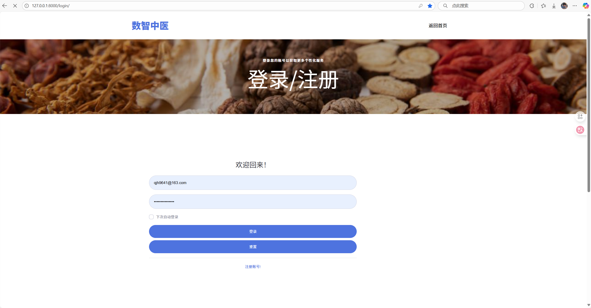

# DigitalCNMedicine
一个基于知识图谱和大语言模型的的中医药智能问答平台，使用django、neo4j、html等工具实现。

# 项目来源与背景
首先感谢[ChessZH](https://github.com/ZhChessOvO)大佬，这个项目是在ta的[ZeLanChao_KGQA](https://github.com/ZhChessOvO/ZeLanChao_KGQA)基础上改进而来,  

我的核心修改是：添加了对话式流式问答界面、 图谱检索、问答界面查看图谱（echarts）、大模型接入、联网搜索（百度）和网络资源推荐等功能，还添加了一个微信小程序。  

其中在智能问答页面关闭大模型和关闭联网搜素功能之后的问答效果，便是传统图谱检索技术（这部分我并未修改）

就像原作者说的，图谱问答技术确实已经过时，我赞成这个观点，但是AI时代，图谱检索技术倒是可以成为大模型的辅助。

图谱具有独特的知识存储结构特性和极高的检索速度，将检索结果作为大模型背景知识，可以有效缓解大模型幻觉。

这个项目我是作为我的本科毕设项目来做的，答辩时候评委给的评价都还算比较高，写这个文档的时候我已经毕业5个月了，不满意目前的工作想跳槽哈哈，因此把之前做的觉得不错或有点用的项目都开源一下，为了那句“有开源项目经历优先”，祝我好运

## 项目截图

智能问答页面（http://127.0.0.1:8000/medicine_ai/）  
1、点击机器人回答下方蓝色字体的链接可以直接跳转外部在线网页   
2、点击【查看图谱】在页面右侧用echarts展示展示图谱，如下图所示
3、输入框上方可选择是否调用大模型和是否开启联网搜索

智能问答页面点击【智能推荐】，预览相关在线资源，可点击跳转

登录注册界面

登录后首先进入的图谱检索界面,输入文字即可进行检索并查看图谱

主页往下划可以看到智能问答功能，点击可进入AI智能问答界面，

还有个微信公众号二维码，扫码关注即可在上面直接和AI对话  
（ps：微信公众号接入的实际上是在coze上搭建的一个智能体，和项目本身数据其实没有关系。  
制作智能体和对发布到微信公众号相关教程可以直接去coze里面找，说白了因为是毕设，答辩时候我直接吹牛说接入的是这个项目的AI，当然真要接入也是可行的，有兴趣的同学可以研究研究。  
微信不支持流式输出，因此回答较慢请耐心等待）

管理员-对话记录管理，需在数据库的medicine_users表中将管理员账号的group字段设置为1，正常注册的用户是0，为普通用户  http://127.0.0.1:8000/qs/

管理员-主页，图谱管理其实是直接跳转到neo4j后台，公众号也是直接跳转到微信官网 http://127.0.0.1:8000/root_index/

编写环境
PyCharm 2023.1

## 安装说明
1. 请确保您的电脑有以下环境：python3，neo4j
2. 在想要安装的文件夹下解压DigitalCNMedicine.zip，双击进入DigitalCNMedicine文件夹
3. 在该目录下进入cmd，输入指令“pip install -r requirement.txt”,安装需要的python库（ps:这个文件其实有些库用不到，因为这个虚拟环境我同时在好几个项目里用）
4. 打开medicine/qs/buidmedicalgraph.py，找到“self.g = Graph("bolt://[YOUR_IP]:7687", user="YOUR_NAME", password="YOUR_PASSWORD")”修改为您的neo4j数据库连接信息
5. 运行目录下的medicine/qs/build_medicalgraph.py，将数据导入neo4j  （ps：由于数据量较大，步骤5的运行时间较长。请在进行步骤5前确保neo4j数据库在运行状态，否则无法导入数据。）
6. 在项目根目录下创建.env文件，位置与内容参考.env.example文件，将阿里百炼大模型的apikey以及neo4j的连接信息填入
7. 在根目录下打开cmd界面，输入指令“python manage.py runserver”
8. 打开浏览器，进入https://127.0.0.1:8000/login，即可使用

